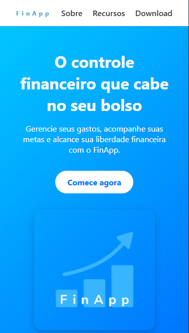

# 📱 FinApp - Landing Page

Landing page fictícia para o **FinApp**, um aplicativo de controle financeiro pessoal. Desenvolvido com foco em **design responsivo**, **boas práticas de HTML e CSS** e **estrutura mobile-first**, sem uso de frameworks ou JavaScript.

## 🛠️ Tecnologias Utilizadas

- **HTML5 semântico**
- **CSS3 moderno**
  - Layout mobile-first
  - Grid e Flexbox
  - Animações e transições
  - Responsividade com media queries
- **Design responsivo**
- **Scroll suave**
- **Tipografia e cores modernas**

## 💡 Objetivo do Projeto

Demonstrar:
- Domínio de HTML e CSS puro
- Capacidade de criar interfaces modernas e responsivas
- Uso de conceitos como:
  - Layout flexível
  - Hierarquia visual
  - UI focada em experiência do usuário (UX)
- Estruturação semântica de páginas web

## 🎯 Funcionalidades

- Menu fixo no topo com navegação entre seções
- Seção Hero com call-to-action
- Cards de recursos do app com ícones e textos
- Chamada para download com botões estilizados
- Rodapé com copyright
- Totalmente responsivo para diferentes tamanhos de tela

## 🖼️ Preview



## 🚀 Como Visualizar

1. Clone o repositório:
   ```bash
   git clone https://github.com/mhrsh/fin-app.git
   ```

2. Abra o arquivo `index.html` no navegador

> Também disponível online via [GitHub Pages](https://seuusuario.github.io/finapp-landing/)

## 📌 Próximas melhorias

- Adicionar formulário de contato (HTML/CSS)
- Otimização para acessibilidade (uso de `aria-label`, contraste aprimorado)
- Versão dark mode
- Mockup real do app

## 📎 Licença

Este projeto foi desenvolvido com fins educacionais, como parte do curso FullStack.
Você pode reutilizar e modificar o código livremente.
